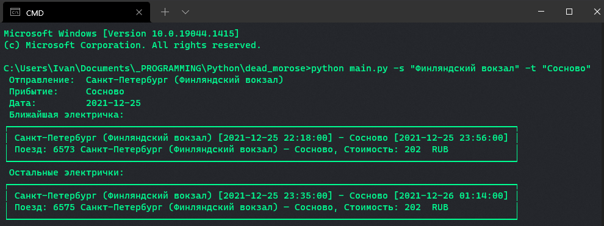
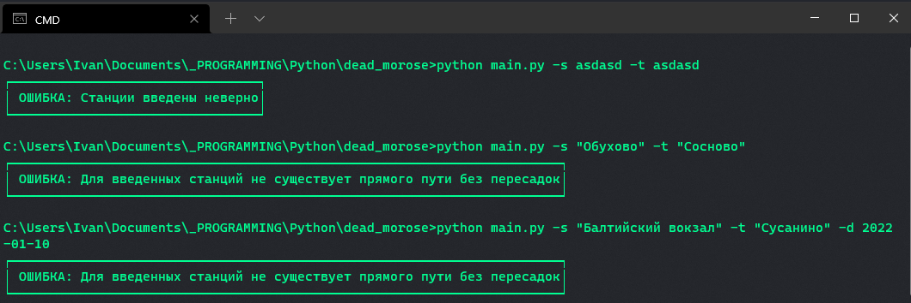
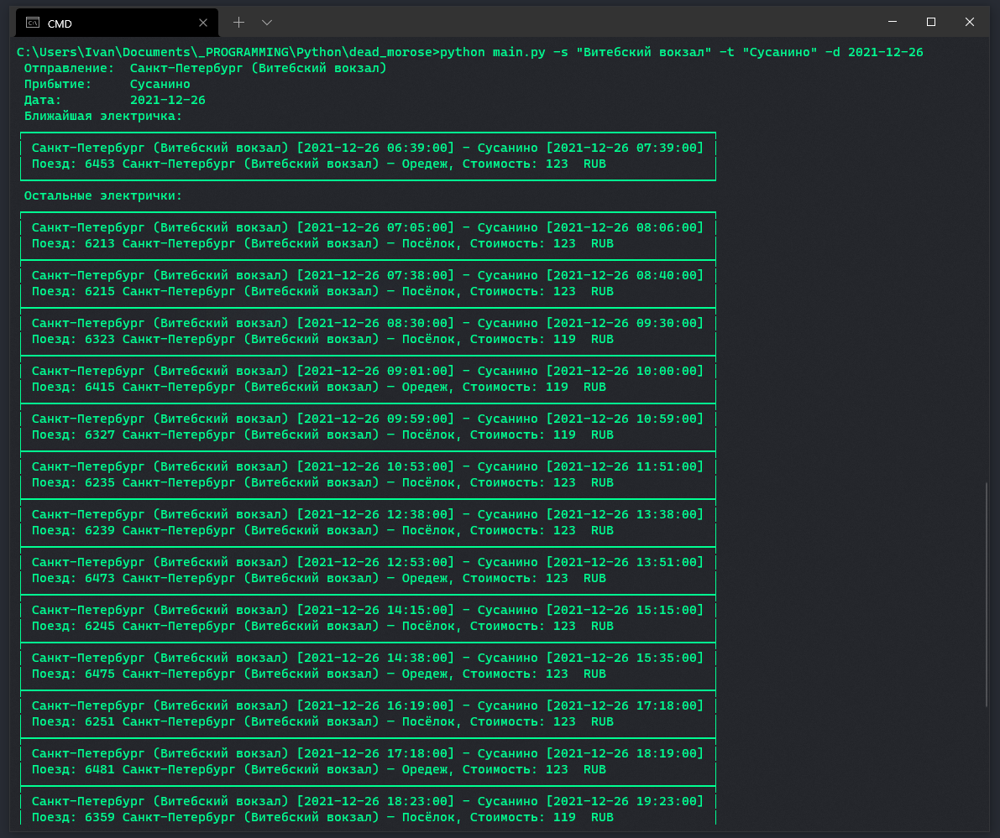

## «К нам едет Дед Мороз»
Постановка задачи следующая: необходимо получить актуальное расписание
электричек от одной станции до другой.
### Особенности реализации
> **Для работы программы необходим токен доступа к API яндекса, установленный в переменную окружения API_TOKEN**

Вариант решения задачи с помощью парсинга сайта [tutu.ru](https://tutu.ru) не представляется возможным,
так как для этого необходимо создавать запрос с учетом идентификаторов станций, 
которые зависят от самого сайта и не могут быть получены извне (по крайней мере, спустя несколько часов поиска 
способ получения этих кодов так и не был найден). Несмотря на то, что сам сайт 
предоставляет API для таких целей, этот интерфейс крайне странный и скорее всего предназначен для коммерческого использования.

Иначе говоря, первым шагом необходимо сдеать запрос к сайту tutu с помощью библиотеки requests, примерно в таком виде:

```python
import requests

response = requests.get(f"https://www.tutu.ru/spb/rasp.php?st1={start_station}&st2={target_station}&date={date}")
```

Для этого в переменные `start_station` и `target_station` необходимо положить коды станций (например, для Финдлянского вокзала код равен
 40105, а для станции Сосново - 47605), при этом данные идентификаторы привязаны к самому сайту и не подчиняются единой системе кодировок.
 
Поэтому, было принято решение получать данные с сервиса Яндекс.Расписание, у которого есть нормально организованный REST-API
и который дает возможность получать авторизованным пользователям крайне много информации в удобном и понятном формате. Для
этого так же был создан новый токен доступа, привязанный к моему аккаунту. 

Программа использует только библиотеку requests и встроенные в Python библиотеки json, datetime, argparse

### Ход работы
#### *1) Получение общего списка станций*
   
`extract_data.get_full_data()` - 
посредством запроса к ресурсу API [https://api.rasp.yandex.net/v3.0/stations_list/](https://api.rasp.yandex.net/v3.0/stations_list/)
получает огромный JSON с **1 800 000** строк и весом **100 Мб** (при сохранении в файл `all_regions.json`)
со всеми возможными станциями, включая аеропорты, автобусные остановки и так далее
вместе с кодами этих станций в системе кодирования Яндекса

`extract_data.exctract_current_region()` - выделяет данные только по региону СПб и Ленобласти и так же сохраняет в новый файл `only_spb.json`

`extract_data.extract_stations()` - выбирает только необходимые для задания данные (то есть только ЖД станции по СПБ и Ленобласти) в следующем виде и сохраняет
в отдельный файл. Данный файл - [only_spb_trains.json](only_spb_trains.json) - весит уже **120 Кб** и включен в зип-архив, поэтому запускать процедуру получения данных
(то есть файл [extract_data.py](utils/extract_data.py)) не обязательно (но можно при желании скачивания и обработки 100Мб данных, полученных в ответ от Яндекса)

```json
{
    "title": "Громово",
    "direction": "Приозерское",
    "yandex_code": "s9602743",
    "transport_type": "train"
}
``` 
#### *2) Обработка результатов*

Прежде всего, для ускорения работы программы поиск идет только по Ж\Д маршрутам и только в пределах Санкт-Петербурга и Ленинградской области.

Так как теперь доступны коды для ЖД станций, можно уже планировать саму утилиту, которая найдет
в списке указанную станцию, сделает запрос к API Яндекса и получит ответ в JSON-е, откуда можно взять уже нужную информацию
и красиво вывести на экран.

Обработка запроса происходит в функции `utils.api.get_schedule()`, 
поиск кода нужной станции в функции `main.search_code()`, красивый вывод результатов - `main.pretty_print()`.


### Basic Usage

Программа сделана как консольная утилита, поэтому необходимые данные указываются как именованные аргументы. 

Например:
```shell script
$ python3 main.py --help
```
```text
usage: main.py [-h] -s START -t TARGET [-d DATE]

Программа поиска расписания электричек по указанному маршруту.

optional arguments:
  -h, --help  show this help message and exit
  -s START    Станция отправления
  -t TARGET   Станция прибытия
  -d DATE     Дата, для которой показывается расписание (в формате ГГГГ-ММ-ДД). По умолчанию - текущая дата
```
---
```shell script
$ python3 main.py -s "Витебский вокзал" -t "Сусанино"
```
```text
 Отправление:  Санкт-Петербург (Витебский вокзал)
 Прибытие:     Сусанино
 Дата:         2021-12-25
 Ближайшая электричка:
┌───────────────────────────────────────────────────────────────────────────────────────────┐
│ Санкт-Петербург (Витебский вокзал) [2021-12-25 21:55:00] - Сусанино [2021-12-25 22:56:00] │
│ Поезд: 6443 Санкт-Петербург (Витебский вокзал) — Оредеж, Стоимость: 119  RUB              │
└───────────────────────────────────────────────────────────────────────────────────────────┘
 Остальные электрички:
┌───────────────────────────────────────────────────────────────────────────────────────────┐
│ Санкт-Петербург (Витебский вокзал) [2021-12-25 23:14:00] - Сусанино [2021-12-26 00:14:00] │
│ Поезд: 6277 Санкт-Петербург (Витебский вокзал) — Посёлок, Стоимость: 123  RUB             │
└───────────────────────────────────────────────────────────────────────────────────────────┘
```
---
```shell script
$ python3 main.py -s "Финляндский вокзал" -t "Сосново" -d 2022-01-10
```
```text
 Отправление:  Санкт-Петербург (Финляндский вокзал)
 Прибытие:     Сосново
 Дата:         2022-01-10
 Ближайшая электричка:
┌────────────────────────────────────────────────────────────────────────────────────────────┐
│ Санкт-Петербург (Финляндский вокзал) [2022-01-10 06:16:00] - Сосново [2022-01-10 07:54:00] │
│ Поезд: 6505 Санкт-Петербург (Финляндский вокзал) — Сосново, Стоимость: 202  RUB            │
└────────────────────────────────────────────────────────────────────────────────────────────┘
 Остальные электрички:
┌────────────────────────────────────────────────────────────────────────────────────────────┐
│ Санкт-Петербург (Финляндский вокзал) [2022-01-10 07:27:00] - Сосново [2022-01-10 09:03:00] │
│ Поезд: 6511 Санкт-Петербург (Финляндский вокзал) — Кузнечное, Стоимость: 202  RUB          │
├────────────────────────────────────────────────────────────────────────────────────────────┤
│ Санкт-Петербург (Финляндский вокзал) [2022-01-10 09:34:00] - Сосново [2022-01-10 11:12:00] │
│ Поезд: 6521 Санкт-Петербург (Финляндский вокзал) — Кузнечное, Стоимость: 202  RUB          │
├────────────────────────────────────────────────────────────────────────────────────────────┤
│ Санкт-Петербург (Финляндский вокзал) [2022-01-10 10:27:00] - Сосново [2022-01-10 12:07:00] │
│ Поезд: 7525 Санкт-Петербург (Финляндский вокзал) — Сосново, Стоимость: 230  RUB            │
├────────────────────────────────────────────────────────────────────────────────────────────┤
│ Санкт-Петербург (Финляндский вокзал) [2022-01-10 11:32:00] - Сосново [2022-01-10 13:12:00] │
│ Поезд: 6529 Санкт-Петербург (Финляндский вокзал) — Сосново, Стоимость: 202  RUB            │
├────────────────────────────────────────────────────────────────────────────────────────────┤
│ Санкт-Петербург (Финляндский вокзал) [2022-01-10 14:19:00] - Сосново [2022-01-10 15:57:00] │
│ Поезд: 6539 Санкт-Петербург (Финляндский вокзал) — Сосново, Стоимость: 202  RUB            │
├────────────────────────────────────────────────────────────────────────────────────────────┤
│ Санкт-Петербург (Финляндский вокзал) [2022-01-10 15:34:00] - Сосново [2022-01-10 17:12:00] │
│ Поезд: 6545 Санкт-Петербург (Финляндский вокзал) — Сосново, Стоимость: 202  RUB            │
├────────────────────────────────────────────────────────────────────────────────────────────┤
│ Санкт-Петербург (Финляндский вокзал) [2022-01-10 16:46:00] - Сосново [2022-01-10 18:23:00] │
│ Поезд: 6551 Санкт-Петербург (Финляндский вокзал) — Кузнечное, Стоимость: 202  RUB          │
├────────────────────────────────────────────────────────────────────────────────────────────┤
│ Санкт-Петербург (Финляндский вокзал) [2022-01-10 17:33:00] - Сосново [2022-01-10 18:43:00] │
│ Поезд: 7579 Санкт-Петербург (Финляндский вокзал) — Кузнечное, Стоимость: 230  RUB          │
├────────────────────────────────────────────────────────────────────────────────────────────┤
│ Санкт-Петербург (Финляндский вокзал) [2022-01-10 17:46:00] - Сосново [2022-01-10 19:26:00] │
│ Поезд: 6553 Санкт-Петербург (Финляндский вокзал) — Сосново, Стоимость: 202  RUB            │
├────────────────────────────────────────────────────────────────────────────────────────────┤
│ Санкт-Петербург (Финляндский вокзал) [2022-01-10 19:13:00] - Сосново [2022-01-10 20:50:00] │
│ Поезд: 6559 Санкт-Петербург (Финляндский вокзал) — Приозерск, Стоимость: 202  RUB          │
├────────────────────────────────────────────────────────────────────────────────────────────┤
│ Санкт-Петербург (Финляндский вокзал) [2022-01-10 20:03:00] - Сосново [2022-01-10 21:44:00] │
│ Поезд: 6563 Санкт-Петербург (Финляндский вокзал) — Сосново, Стоимость: 202  RUB            │
├────────────────────────────────────────────────────────────────────────────────────────────┤
│ Санкт-Петербург (Финляндский вокзал) [2022-01-10 20:35:00] - Сосново [2022-01-10 22:12:00] │
│ Поезд: 6567 Санкт-Петербург (Финляндский вокзал) — Кузнечное, Стоимость: 202  RUB          │
├────────────────────────────────────────────────────────────────────────────────────────────┤
│ Санкт-Петербург (Финляндский вокзал) [2022-01-10 22:18:00] - Сосново [2022-01-10 23:56:00] │
│ Поезд: 6573 Санкт-Петербург (Финляндский вокзал) — Сосново, Стоимость: 202  RUB            │
├────────────────────────────────────────────────────────────────────────────────────────────┤
│ Санкт-Петербург (Финляндский вокзал) [2022-01-10 23:35:00] - Сосново [2022-01-11 01:14:00] │
│ Поезд: 6575 Санкт-Петербург (Финляндский вокзал) — Сосново, Стоимость: 202  RUB            │
└────────────────────────────────────────────────────────────────────────────────────────────┘
```

## Скриншоты


